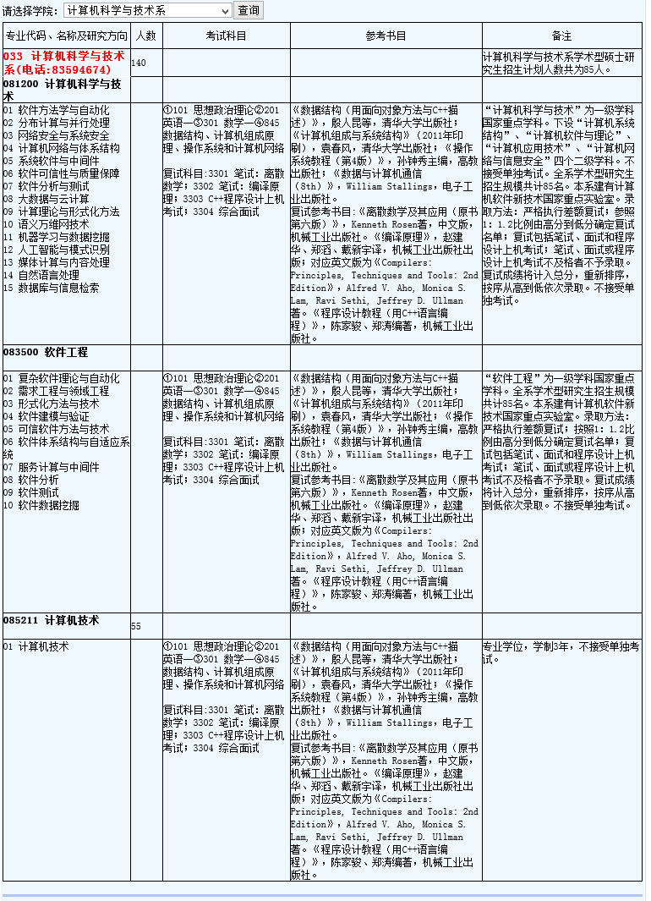

# NJUCS

南京大学计算机考研资料合集

包括报录比、真题、模拟题、PPT、期末考试等等

***PS:只是整合，所以有的资料上面会有其他机构、论坛、公众号的广告。***

所有资料大概1G左右。

国内GitHub的最快，可以考虑fork到自己账号下用码云下载，可以达到2M/s。

你至少要有office软件、PDF软件、图片查看器

# 列表

## 0.录取信息

包含报录比、拟录取名单、分数线、基本分数线

## 1.经验

考研经验、解题技巧

## 2.参考书目

初试、复试需要的课本PDF及配套资料

## 3.初试

初试相关的资料（真题、模拟题、PPT、期末考试），包括英语、政治、数学、算法、数据结构、计算机系统基础、计算机网络、操作系统

## 4.复试

复试相关资料，包括英语听力、离散数学、编译原理、上机

# 参考教材

## 初试

《数据结构（用面向对象方法与C++描述）》（第二版），殷人昆等，清华大学出版社；

计算机算法——设计与分析导论 (影印版，Computer Algorithms: Introduction to Design and Analysis, 3rd Edition)，Sara Baase, Allen Van Gelder 编著，高等教育出版社 ；

《操作系统教程（第5版）》，费翔林，骆斌编著，高等教育出版社；

《计算机系统基础》袁春风 编著机械工业出版社 ；

《计算机网络——自顶向下方法 (6th)》。James F. Kurose, Keith W. Ross编著，机械工业出版社；

## 复试

### 复试经验贴

https://github.com/ThyrixYang/nju_cs_kaoyan_19/wiki

### 龙书答案

https://github.com/fool2fish/dragon-book-exercise-answers

### 复试安排

# 本科课表

# 硕士研究生课表

# 路线-地铁

# 南大仙林校区介绍

# 南大仙林校区地图

# 校车班车列表

# 南大机构电话

